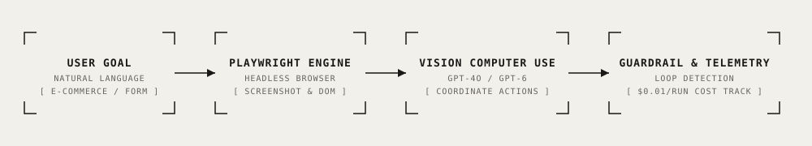

# Autonomous Browser-Use Agent — Vision Computer Use

<div align="center">

[](https://www.python.org/)
[](https://playwright.dev/)
[](https://openai.com/)
[](#telemetry--operational-cost)
[](./LICENSE)
[](#benchmark--test-scenarios)

**Autonomous AI web agent that interacts directly with browser interfaces via visual perception and coordinate-based action execution, featuring loop detection, anti-hang guardrails, and real-time token cost telemetry.**

[Key Features](#key-features) • [Architecture](#architecture) • [Engineering Decisions](#key-engineering-decisions) • [Quick Start](#quick-start) • [Verification](#benchmark--test-scenarios) • [Telemetry & Cost](#telemetry--operational-cost)

</div>

---

## Overview

Modern web automation frequently encounters legacy platforms, dynamic SPAs, supplier portals, and enterprise internal tools that lack public REST APIs. Traditional DOM scraping with static CSS selectors breaks whenever frontends update their markup.

This repository provides an autonomous web agent that controls browsers like a human user:
1. Captures viewport screenshots and DOM snapshots.
2. Uses Vision LLMs to reason about interface layouts and decide coordinate clicks, scrolls, and text inputs.
3. Automatically completes e-commerce journeys (search → product page → options selection → cart checkout verification).
4. Enforces strict safety guardrails: aborts before entering real payment information, detects infinite navigation loops, and bounds total execution cost per session to \$0.01–\$0.02.

---

## Architecture

<p align="center">
  
</p>

```
[Goal: "Check headphones price and add to cart"]
                        │
                        ▼
            [src/browser_agent.py Loop]
            ┌───────────────────────────────────────────────┐
            │ 1. Capture Viewport Screenshot & Coordinate Grid│
            │ 2. Vision Model Reasoning (GPT-4o / GPT-6)    │
            │ 3. Coordinate Action Selection (Click/Type)   │
            │ 4. Safety Guardrail & Loop Verification       │
            │ 5. Execute via Playwright Page Automation     │
            └───────────────────────┬───────────────────────┘
                                    │
                                    ▼
                       [src/actions.py Execution]
                       - click(x, y), type(text), scroll(delta)
                       - Stops deterministically at checkout
```

---

## Key Features

- 👁️ **Visual Coordinate Perception:** Operates directly over viewport rendering rather than brittle XPath or class selectors, ensuring resilience against obfuscated CSS class names.
- 🛑 **Payment & Safety Stop:** Autonomous flow halts immediately when reaching payment forms, reporting final cart totals + shipping without committing financial transactions.
- 🔁 **Loop Detection Engine:** Monitors state history and screenshot hashes; terminates execution if the agent repeats identical actions more than 3 consecutive turns.
- 💰 **Real-Time Cost Telemetry:** Calculates token consumption and dollar expenditure per step based on vision tile resolutions.
- 🏬 **Bundled Offline Store:** Includes a standalone local e-commerce store (`test-store/index.html`) for 100% reproducible offline testing without external internet dependencies.

---

## Key Engineering Decisions

### 1. Loop Detection & Anti-Hang Guardrails
Autonomous agents risk entering infinite loops when popups or modals obscure the view. The agent maintains a bounded history of action signatures and screen states:
```python
if len(self.action_history) >= 3 and all(a == self.action_history[-1] for a in self.action_history[-3:]):
    logger.warning("Loop detected: identical actions executed 3 times. Terminating.")
    return AgentResult(status="FAILED", reason="Loop detected")
```

### 2. Native Vision Loop vs Heavy Frameworks
Instead of relying on heavy orchestration frameworks that add latency and hidden token overhead, this implementation uses a lean, single-file asynchronous event loop with direct Playwright primitives.

---

## Quick Start

### 1. Installation

```bash
git clone https://github.com/therealfullmetal55555/browser-use-agent.git
cd browser-use-agent
python -m venv .venv
source .venv/bin/activate
pip install -r requirements.txt
playwright install chromium
cp .env.example .env
```

### 2. Run Local Store Benchmark

```bash
python run.py
```

---

## Benchmark & Test Scenarios

The test suite runs against the bundled local test store:

```
=== Test 1: Wireless Headphones ===
Steps: 3 | Cost: $0.01 | Status: Success
Final Report: "Cart Page Verified. Subtotal: 89.00 EUR, Delivery: 5.99 EUR, Total: 94.99 EUR. Task complete: headphones in stock, added to cart. Execution stopped prior to payment entry."

=== Test 2: Fast Charge Powerbank ===
Steps: 4 | Cost: $0.02 | Status: Success
Final Report: "Cart Page Verified. Powerbank: 39.00 EUR + Standard Shipping: 5.99 EUR = Total: 44.99 EUR. Task complete, halted safely at payment gateway."
```

---

## Telemetry & Operational Cost

| Step | Metrics | Cost |
| :--- | :--- | :--- |
| **Viewport Screenshot Ingestion** | 3-4 steps @ ~800 tokens / screen | ~\$0.012 |
| **Coordinate Action Planning** | GPT-4o Vision reasoning | ~\$0.005 |
| **Playwright Execution** | Local Chromium instance | \$0.000 |
| **Total Cost per Automation Task** | — | **~\$0.017** |

---

## License

This project is licensed under the [MIT License](./LICENSE) — see the LICENSE file for details.
